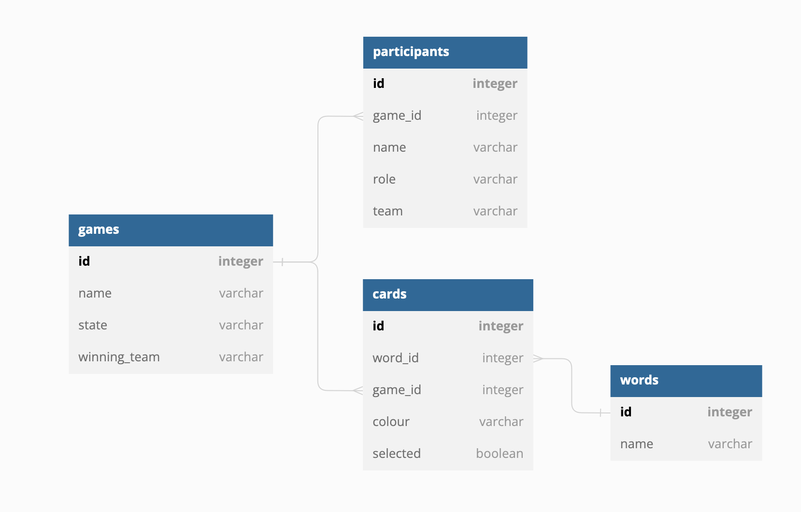

# Cross Digital Complete

This is the code following the hack day. It is a game inspired by [Code Names](https://codenames.game/)
It is a fully working 4 player game where 2 teams compete to find all their words first.

As this was a hack day, we did not write any tests. There were also questionable design decisions made in the interest of time.

We originally started a Rails 6 app, that has commit history. See here: [CrossDigital](https://github.com/crossdigital/crossdigital).
But wanted to use Turbo Rails to allow for a more SPA like experience. So we started this Rails 7 app, and copied over the code.

To run, clone this repo and run `bundle install` and `yarn install`. Then run `bin/rails s` and navigate to `localhost:3000`

Here is an image of the database structure we used:

